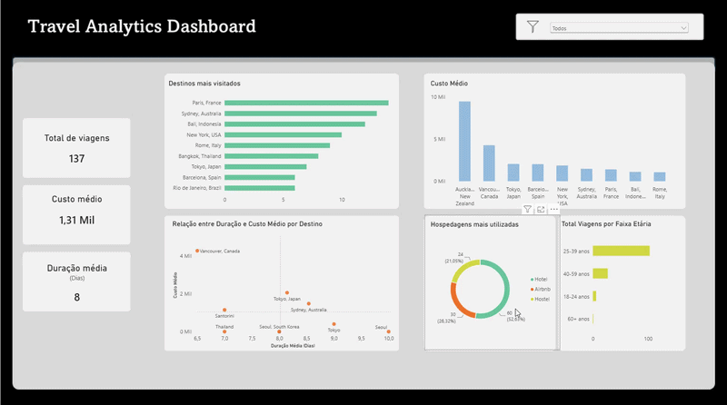

# ✈️ Travel Data Analysis (Análise de Dados de Viagens)

### 📖 Sobre o Projeto
Projeto de análise de dados de viagens baseado em um dataset do Kaggle. O objetivo principal é praticar **modelagem relacional**, **higienização de dados (ETL)**, **consultas SQL analíticas** no SQL Server, **modelagem e métricas** com Power BI e DAX. 

## 🛠️ Tecnologias & Ferramentas

* **SGBD:** SQL Server (T-SQL, Views, Limpeza de Dados e Tipagem)
* **Visualização & BI:** Power BI Desktop (DAX, Modelagem, Filtros Dinâmicos)
* **Design UX/UI:** Microsoft PowerPoint (Layout de tela e telas de fundo customizadas)
* **Dataset:** [Kaggle - Traveler Trip Data](https://www.kaggle.com/datasets/rkiattisak/traveler-trip-data)
* **Versionamento:** Git & GitHub

### 📌 Etapas do Projeto
- [x] **Modelagem & Normalização:** Criação da estrutura relacional (chaves PK/FK e auto-incremento).
- [x] **ETL & Limpeza de Dados:** Sanitização de textos (`NVARCHAR`) e conversão para tipos numéricos (`DECIMAL`).
- [x] **Análise de Negócio:** Queries analíticas (`GROUP BY`, `JOINs`, agregações).
- [x] **Visualização:** Integração com Power BI.

---

### 📖 About
A travel data analysis project based on a Kaggle dataset. The main goal is to practice **relational modeling**, **data cleaning (ETL)**, and **analytical SQL queries** using SQL Server.

### 🛠️ Tech Stack

* **SGBD:** SQL Server (T-SQL)
* **Analytics & BI:** Power BI Desktop / DAX
* **UX/UI Design:** Microsoft PowerPoint
* **Version Control:** Git & GitHub

### 📌 Project Roadmap
- [x] **Modeling & Normalization:** Relational schema design (PK/FK constraints and auto-increment).
- [x] **ETL & Data Cleaning:** Text sanitization (`NVARCHAR`) and conversion to numeric types (`DECIMAL`).
- [x] **Business Analysis:** Analytical SQL queries (`GROUP BY`, `JOINs`, aggregations).
- [x] **Visualization:** Integration with Power BI.
---

## 📊 Dashboard Interativo

*(Visualização estática disponível em `images/dashboard.png`)*