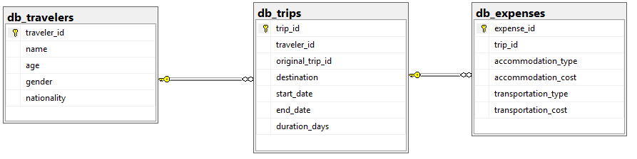

# Modelo do Banco de Dados

## Estrutura do Banco

O banco de dados está organizado em três tabelas principais:

- `db_travelers`: armazena informações sobre os viajantes.
- `db_trips`: armazena informações sobre as viagens.
- `db_expenses`: armazena informações sobre os custos de hospedagem e transporte.

## Relacionamentos entre as Tabelas

As tabelas estão relacionadas por meio das seguintes chaves:

- `db_travelers.traveler_id` → `db_trips.traveler_id`
- `db_trips.trip_id` → `db_expenses.trip_id`

Esses relacionamentos permitem combinar informações dos viajantes, das viagens e das despesas utilizando `JOINs` no SQL.

## Tabelas

### db_travelers

| Coluna | Descrição |
|---|---|
| `traveler_id` | Identificador único do viajante |
| `name` | Nome do viajante |
| `age` | Idade do viajante |
| `gender` | Gênero do viajante |
| `nationality` | Nacionalidade do viajante |

### db_trips

| Coluna | Descrição |
|---|---|
| `trip_id` | Identificador único da viagem |
| `traveler_id` | Identificador do viajante |
| `original_trip_id` | Identificador original da viagem no conjunto de dados |
| `destination` | Destino da viagem |
| `start_date` | Data de início da viagem |
| `end_date` | Data de término da viagem |
| `duration_days` | Duração da viagem em dias |

### db_expenses

| Coluna | Descrição |
|---|---|
| `expense_id` | Identificador único da despesa |
| `trip_id` | Identificador da viagem relacionada |
| `accommodation_type` | Tipo de hospedagem |
| `accommodation_cost` | Custo da hospedagem |
| `transportation_type` | Tipo de transporte |
| `transportation_cost` | Custo do transporte |